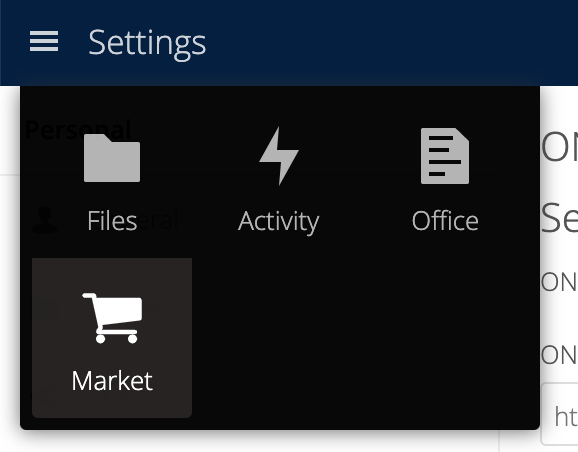
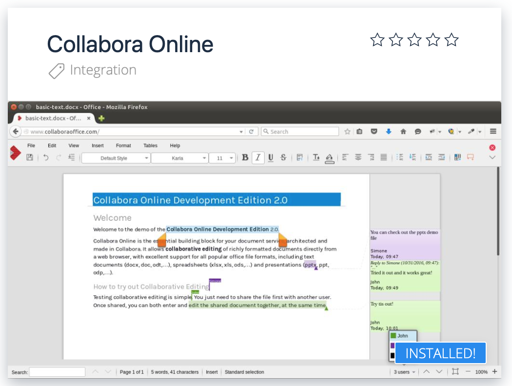
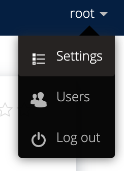
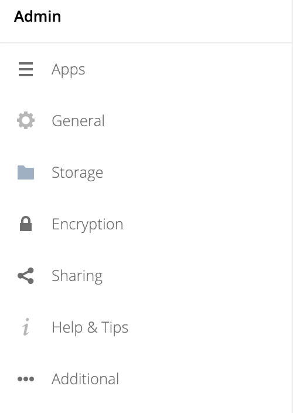
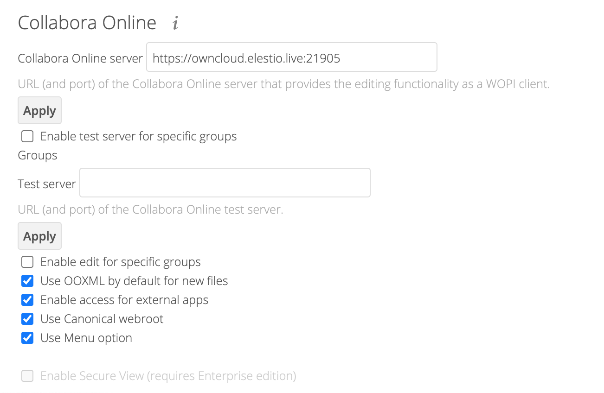
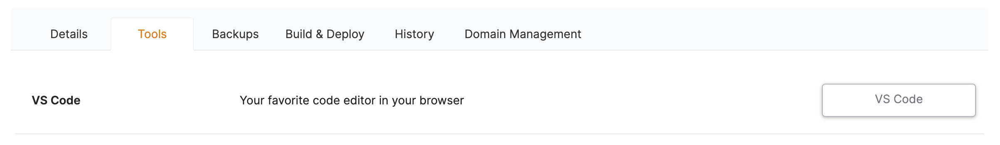
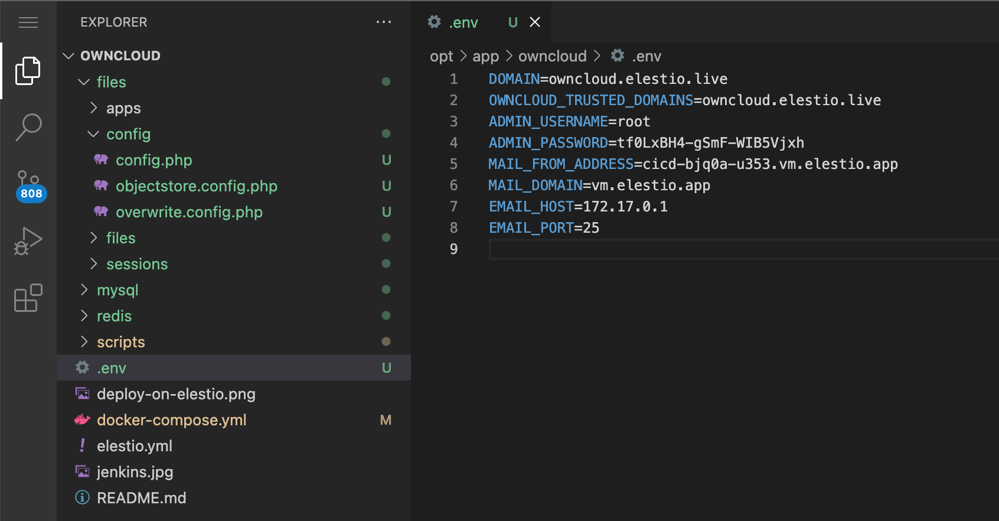
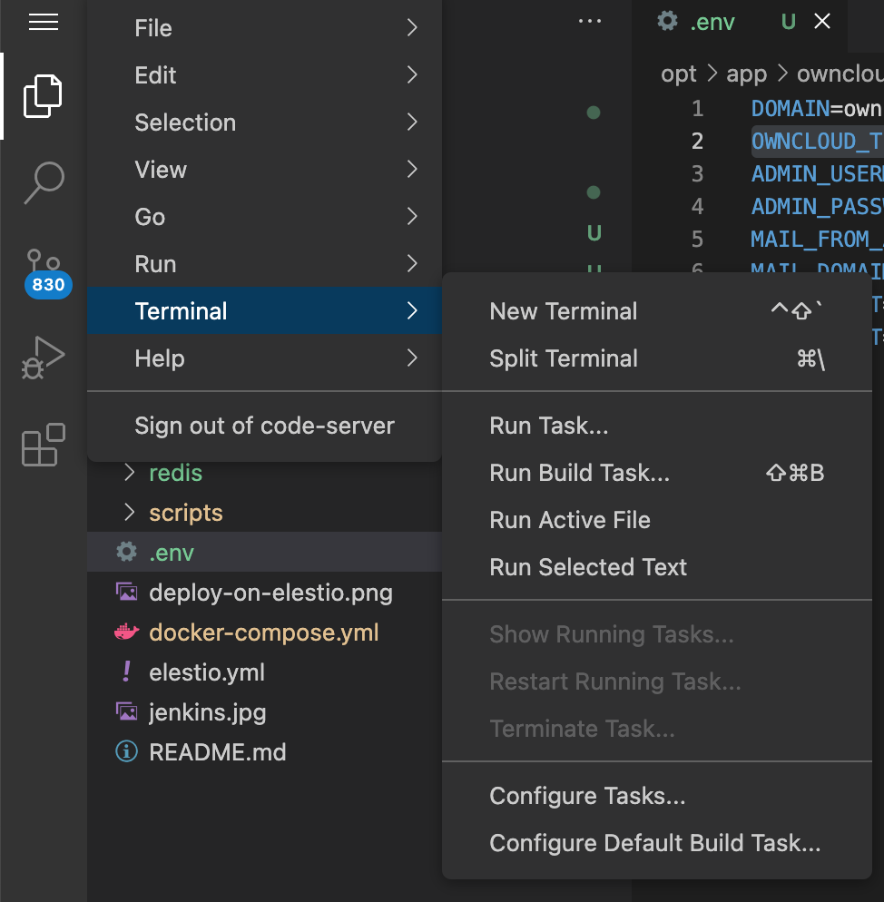

# Owncloud CI/CD pipeline

Deploy Owncloud Infinite Scale server with CI/CD on Elestio

 
 

# Once deployed ...

You can can open Owncloud UI here:

    URL: https://[CI_CD_DOMAIN]
    Login: root
    password: [ADMIN_PASSWORD]

# COLLABORA

If you want to use Collabora, click on Settings at the top left, and choose Market.
In the new window, find Collabora and install it.

Once installed, click on your nickname at the top right, and click on Settings.
On the left side, go to the Admin submenu and click on Additional.
In the Collabora Online Server field, enter this information:
https://[DOMAIN]:21905
Click Apply.

# TRUSTED DOMAINS

If you want to use a custom domain, go to your Pipeline, then click on the Tools tab, then choose VS Code.

Once VS Code is opened, open the .env file, then change the values of DOMAIN and OWNCLOUD_TRUSTED_DOMAINS to your domain.

Click on the burger menu at the top left, then choose Terminal>New Terminal.

In the window that just opened, type:

    docker-compose down
    docker-compose up -d

Close the window.

From this point, you will only be able to use Collabora with this domain.
